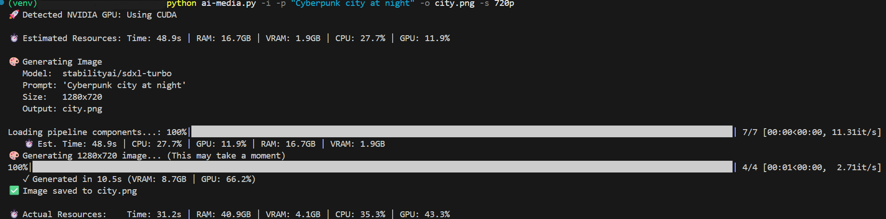
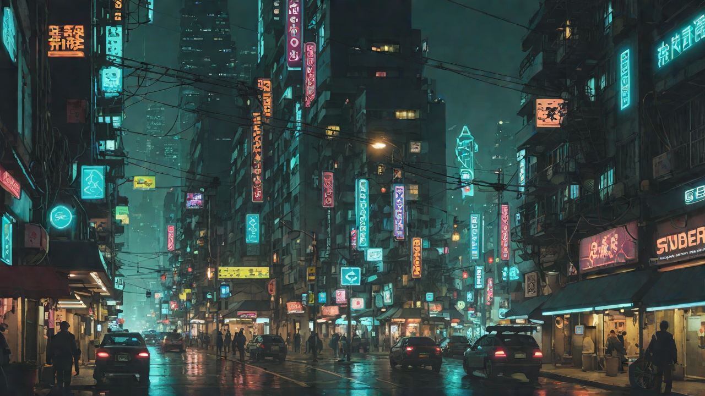
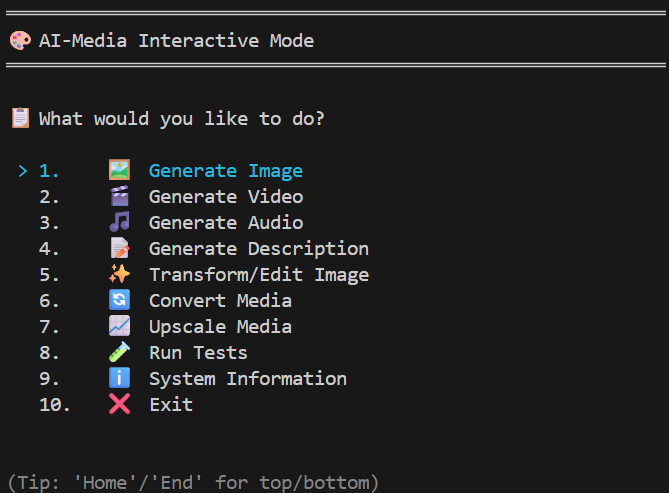
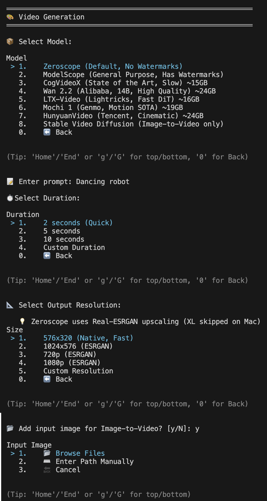

# AI-Media

Generate images, videos, and audio locally using state-of-the-art open source AI models. Transform and edit images with natural language instructions or remove backgrounds. Describe and analyze media content. Upscale existing media with or without AI. Convert between formats instantly. This tool wraps libraries like `diffusers`, `transformers`, and `FFmpeg` into a simple, unified command-line interface. It also includes unit and integration tests to verify the functionality of the tool. 

Consider using these models more for personal use and experimenting, as most of them require a lot of resources, especially for video generation. The idea was to prove that local AI Media models can be run on personal computers, and to build a python wrapper that allows for easy execution of these models.

 

## Features

- 🎨 **Image Generation** - **Text-to-Image** using models like Flux/SDXL (via `diffusers`). See [Image Options](#image-options), [Examples](#image-generation-examples) and [Models](#image-models).
- 🎬 **Video Generation** - **Text-to-Video**, **Image-to-Video**, and **Text/Image + Audio (prompt) to Video**. See [Video Options](#video-options), [Examples](#video-generation-examples) and [Models](#video-models).
- 🎵 **Audio Generation** - **Text-to-Audio** (either instructional prompt with most models, or text to speech with multi language support and human speaker voices with the Bark model) and **Image-to-Audio** / **Video-to-Audio** (using Visual Captioning + Audio Generation). Models: MusicGen, AudioLDM 2. See [Audio Options](#audio-options), [Examples](#audio-generation-examples) and [Models](#audio-models).
- 📝 **Description Generation** - **Generate a description** for an image or video (sample 10 evenly picked frames used) using models like Florence/BLIP (via `transformers`). See [Description Options](#description-generation-options), [Examples](#description-generation-examples) and [Models](#description-generation-models). If you are interested in producing a subtitle file based on Audio or Video using AI, see my [auto-subtitles project](https://github.com/lvladikov/auto-subtitles).
- 🪄 **Creative Image Transformations** - **Edit images using natural language instructions** (InstructPix2Pix) or **remove backgrounds** (RMBG-1.4). Supports style transfer (Anime, Oil Painting), content modification (features, age), and utility tasks (Background Removal, Silhouettes). See [Creative Image Transformations Options](#creative-image-transformations-options), [Examples](#creative-image-transformation-examples) and [Models](#creative-image-transformation-models).
- 🔄 **Media Conversion** - **Instantly convert** images, videos, and audio between formats (no AI, uses PIL/FFmpeg). See [Media Conversion Options](#media-conversion-options) and [Examples](#media-conversion-examples).
- 📈 **Upscaling** - **Upscale** images and videos using AI (Real-ESRGAN for fast/faithful, Stable Diffusion for creative) or simple non-AI (Lanczos/FFmpeg). Supports any resolution (8K+ auto-encodes as HEVC). See [Upscaling Options](#ai-upscaling-options), [Examples](#ai-upscaling-examples) and [Models](#upscaling-models).
- 🖥️ **Interactive Mode** - Optional **guided menu system** with arrow key navigation for all features, when no parameters are provided to the main script. [See details](#interactive-mode).
- 🧪 **Testing** - **Unit and integration tests** to verify the functionality of the tool. See [Testing](#testing).
- ⚙️ **Power User Controls**
    - Flexible resolution parsing (strings like "720p", "4k", "1920x1080", or objects like `{w:1920, h:1080}`)
    - Smart time parsing ("1h50m", "15s", `{m:2, s:30}`)
- 🚀 **Hardware Accelerated** - Auto-detects and optimizes for:
    - 🍏 **Apple Silicon** (MPS / Metal)
    - 🟢 **NVIDIA GPUs** (CUDA + Float16)
    - 🟡 **Codec Analysis Tool** - Verify your system's hardware and software encoding limits. See [Codec Analysis Tool](#codec-analysis-tool).
    - 💻 **Performance Tracking** - To improve estimation accuracy, the script creates a `performance.json` file in its directory. This file is **local only** and never uploaded. To disable, use `--no-performance-tracking` (or `-npt`). [See details](#performance-tracking).

> [!NOTE]
> **Performance Reality (2025):** NVIDIA GPUs with CUDA currently deliver the fastest AI processing due to a mature ecosystem refined since 2006. However, **with optimizations in this script, all operations run successfully on Apple Silicon/MPS—just behind NVIDIA performance**. See Mac-specific tweaks in [Image Models](#image-models), [Video Models](#video-models), and [Upscaling](#ai-upscaling-options). Currently, bfloat16 support on MPS is incomplete (causes hangs), so this script enforces float32 precision—doubling memory usage but ensuring stability. Future bfloat16 improvements in PyTorch and Apple Silicon are expected, which would mean less RAM usage while maintaining great precision. Apple's unified memory architecture already provides advantages for memory-heavy tasks and energy efficiency.

## Prerequisites

1.  **Python 3.10 - 3.12** (3.12 is recommended for improved performance)
2.  **FFmpeg** (Required for video generation, conversion, and proper playback)
    -   macOS: `brew install ffmpeg`
    -   Linux: `apt install ffmpeg`
    -   Windows: `winget install ffmpeg` or Download from [ffmpeg.org](https://ffmpeg.org/download.html)

3.  **Python Dependencies** (installed automatically via requirements.txt, see [Installation - Step 4](#installation))

    - **diffusers**: State-of-the-art Image & Video generation pipelines
    - **transformers**: Audio generation & text processing models
    - **torch**: Core deep learning framework & hardware acceleration (CUDA/MPS)
    - **accelerate**: Optimization for efficient large model loading
    - **opencv-python**: Video frame processing & manipulation
    - **scipy**: Audio signal processing & file handling
    - **realesrgan**: Real-ESRGAN for faster, high-quality image/video upscaling
    - **imageio-ffmpeg**: FFmpeg bindings for video export (used by diffusers)

4.  **Gated Models (Optional)**
    Some state-of-the-art models (like `FLUX.1`) require Hugging Face authentication (but are **free to use**):

    1.  **The Hugging Face CLI will be installed as part of the installation process (requirements.txt)**
    2.  Create a **Free** [Hugging Face Account](https://huggingface.co/join).
    3.  **Accept model licenses**: Visit each model page and click **"Agree and access repository"** (one-time per model):
        | Model | Accept License |
        | :--- | :--- |
        | FLUX.1-schnell (`flux`) | [Accept License](https://huggingface.co/black-forest-labs/FLUX.1-schnell) |
        | FLUX.1-dev (`flux-dev`) | [Accept License](https://huggingface.co/black-forest-labs/FLUX.1-dev) |
        | Stable Audio Open (`stable-audio`) | [Accept License](https://huggingface.co/stabilityai/stable-audio-open-1.0) |
    4.  **Create an Access Token**: Go to [Settings → Access Tokens](https://huggingface.co/settings/tokens) and create a new token:
        - **Quick option**: Select **"Read"** token type for simple read access to all repos.
        - **Fine-grained option**: Select **"Fine-grained"** and enable **"Read access to contents of all public gated repos you can access"** under Repositories.
    5.  **Login**: Run `hf auth login` in your terminal, paste your Access Token, and answer **`n`** to "Add token as git credential?" (only needed for pushing to HF repos).

---


## Installation

```bash
# 1. Clone or navigate to the project
cd ai-media

# 2. Create virtual environment
# TIP: Create with a specific version (e.g. 3.12) if your default 'python3' is too new (like 3.14).

   # macOS (Homebrew):
   /opt/homebrew/bin/python3.12 -m venv venv

   # or
   
   python3.12 -m venv venv

   # Linux:
   python3.12 -m venv venv

   # Windows:
   py -3.12 -m venv venv

# 3. Activate environment
source venv/bin/activate
    # Windows:
    .venv\Scripts\activate.bat
    # or for PowerShell:
    # if needed: Set-ExecutionPolicy -ExecutionPolicy RemoteSigned -Scope CurrentUser
    .venv\Scripts\Activate.ps1

# 4. Install dependencies
pip install -r requirements.txt

# 5. [Optional] Login to Hugging Face (Free); See Gated Models (Optional) section above.
# Only required if you want to use Gated models like Flux.
hf auth login
# (Paste your Access Token when prompted. It is invisible.)
```

## Usage

The script `ai-media.py` is the main entry point.

**Example Command:**




**Example Output:**




### Generation Modes

- `-i, --generate-image`: Generate an image
- `-v, --generate-video`: Generate a video
- `-a, --generate-audio`: Generate audio/music
- `-gd, --generate-description`: Describe an image or video
- `-ti, --transform-image`: Creatively transform/edit an image
- `-ci/-cv/-ca`: Convert media formats
- `-ui/-uv`: Upscale media

### Common Options

| Option | Description |
| :--- | :--- |
| `-p, --prompt` | Text description of content to generate. |
| `-o, --output` | Output filename/path. **Optional**: auto-generated from first 2 words of prompt if omitted. |
| `-f, --format` | Explicit file format. **Image**: jpg, png (default: jpg). **Video**: mp4 (default: mp4). **Audio**: mp3, wav (default: mp3). |
| `--force` | Skip all confirmation prompts (overwrites existing files and ignores resource warnings). |
| `-s, --size` | Resolution. Supports "720p", "1080p", "4k", "8k", "HD", "1280x720", `{w:1280, h:720}`. Default: 720p. |
| `-npt, --no-performance-tracking` | Disable creating/updating `performance.json` and time estimates. [Read more](#performance-tracking). |

### Image Options

| Option | Description |
| :--- | :--- |
| `--image-model` | Model: `sdxl` (default), `sd-1.5`, `flux`, `flux-dev`. See [Image Models](#image-models-image-model). |
| `-otn, --orientation` | `landscape` (default), `portrait`, or `square`. Portrait swaps w/h. |
| `--unsafe` | Disable NSFW safety checker (reduces false positives). |

[See Image Generation Examples](#image-generation-examples) and [Models](#image-models).

### Video Options

| Option | Description |
| :--- | :--- |
| `--video-model` | Model: `zeroscope` (default), `ms-1.7b`, `wan2.2`, `ltx-video`, `mochi-1`, `hunyuan`, `cogvideox`, `svd`. |
| `-s, --size` | Target resolution. For zeroscope: triggers **Dynamic Upscaling** (XL + Real-ESRGAN). |
| `-l, --length` | Duration. Supports "2s", "5s", "1m", `{m:1, s:30}`. Default: 2s. |
| `-ii, --input-image` | Source image path for **Image-to-Video** generation (SVD, CogVideoX I2V). |
| `-ap, --audio-prompt` | **Text prompt** for generating background audio (e.g., "Techno beat"). Automatically muxes with video. Use `-am` to select audio model. |

[See Video Generation Examples](#video-generation-examples) and [Models](#video-models).

### Audio Options

| Option | Description |
| :--- | :--- |
| `--audio-model` | Model: `musicgen-medium` (default), `musicgen-small`, `musicgen-large`, `audioldm2`, `stable-audio`, `bark`. See [Audio Models](#audio-models-audio-model). |
| `-l, --length` | Duration. Supports "15s", "1m", "1h30m", `{m:1, s:30}`. Default: 15s. |
| `-ii, --input-image` | Source image/video for **Image-to-Audio** or **Video-to-Audio** (auto-captions then generates audio). |
| `-m, --sampling-rate` | Sample rate in Hz (e.g. `44100`, `48k`, `32000`). Default: 32000. |
| `-b, --bit-depth` | Bit depth (16, 24, 32). Default: 16. |
| `-r, --bit-rate` | Target bitrate (e.g. `128k`, `320kbps`). |
| `--voice-preset` | Bark voice preset (e.g. `v2/en_speaker_6`, `v2/fr_speaker_1`). Default: v2/en_speaker_6. |

[See Audio Generation Examples](#audio-generation-examples) and [Models](#audio-models).

### Description Generation Options

| Option | Description |
| :--- | :--- |
| `-gd, --generate-description` | Generate caption/description for input image/video. For videos, 10 evenly-spaced frames are sampled and described. |
| `-cm, --caption-model` | Model: `florence` (default), `blip`. See [Caption Models](#caption-models). |
| `-o, --output` | Output text filename (optional). |

[See Description Generation Examples](#description-generation-examples) and [Models](#description-generation-models). If you are interested in producing a subtitle file based on Audio or Video using AI, see my [auto-subtitles project](https://github.com/lvladikov/auto-subtitles).

### Creative Image Transformations Options

Edit existing images using AI instructions or remove backgrounds.

| Argument | Description |
| :--- | :--- |
| `-ti`, `--transform-image` | Path to the image file to transform. |
| `-p`, `--prompt` | Edit instruction (works for standalone transformations). |
| `-tp`, `--transform-prompt` | Edit instruction for chaining with generation (e.g., `-i -p "..." -ti file -tp "..."`). |
| `--remove-background`, `-rb` | Remove background (outputs transparent PNG). |
| `--silhouette` | Create a black silhouette (requires `--remove-background`). |
| `--image-guidance` | Image guidance scale (default: `1.5`). Higher = closer to original structure. |

> [!NOTE]
> **`-p` vs `-tp`**: For standalone transformations (`-ti` only), use `-p`. When chaining generation (`-i`) with transformation (`-ti`), use `-p` for the **generation prompt** and `-tp` for the **edit instruction**.


**Transformation Recipe Book 🪄**
Here are prompt examples for common editing tasks.

| Goal | Command Pattern |
| :--- | :--- |
| **Styles** | |
| Anime / Manga | `-tp "Turn the subject into an anime character"` |
| Disney / Pixar | `-tp "Make the subject look like a 3D Pixar character"` |
| Studio Ghibli | `-tp "Make it look like a Studio Ghibli movie"` |
| Oil Painting | `-tp "Make it look like an oil painting"` |
| Watercolor | `-tp "Turn this into a watercolor painting"` |
| Pencil Sketch | `-tp "Turn this into a pencil sketch"` |
| Cartoon | `-tp "Turn this into a flat cartoon"` |
| Coloring Page | `-tp "Make it a black and white coloring page"` |
| Sticker | `-tp "Turn this into a sticker with a white outline"` |
| **Photo Manipulations** | |
| Remove Beard | `-tp "Remove the beard"` |
| Change Hairstyle | `-tp "Give the subject a mohawk hairstyle"` |
| Facial Expressions | `-tp "Make the subject smile"`, `-tp "Make the subject look surprised"` |
| Age / Baby | `-tp "Make the subject look like a baby"` |
| Caricature | `-tp "Turn this into a funny caricature"` |
| Recolor | `-tp "Change the red dress to blue"` |
| Colorize B&W | `-tp "Colorize this photo"` |
| Sketch to Image | `-tp "Turn this sketch into a photo of an apple"` |
| **Removal** | |
| Background | `--remove-background` (No prompt needed) |
| Silhouette | `--remove-background --silhouette` |
| Text / Objects | `-tp "Remove the text"`, `-tp "Remove the cup"` (Experimental) |

[See Transformation Examples](#creative-transformation-examples) and [Models](#creative-image-transformation-models).

### Media Conversion Options

| Option | Description |
| :--- | :--- |
| `-ci, --convert-image` | Convert image format (e.g., gif→png). |
| `-cit, --convert-image-to` | Output format (png, .webp, out.jpg). |
| `-cv, --convert-video` | Convert video (mov→mp4). |
| `-cvt, --convert-video-to` | Output format (mp4, .webm, out.avi). |
| `-ca, --convert-audio` | Convert audio (wav→mp3). |
| `-cat, --convert-audio-to` | Output format (mp3, .flac, out.ogg). |
| `--convert-image-engine` | pil (default) or ffmpeg. |

[See Conversion Examples](#media-conversion-examples).

### AI Upscaling Options

| Argument | Description | Default |
| :--- | :--- | :--- |
| `-ui`, `--upscale-image` | Path to the image file to upscale. | `None` |
| `-uv`, `--upscale-video` | Path to the video file to upscale. | `None` |
| `-uof`, `--upscaled-output-file` | Custom filename for the upscaled output. | Auto: `name_upscaled_{factor}x.ext` |
| `-uf`, `--upscale-factor` | Multiplier for resolution (e.g., `1.5`, `2.0`, `4.0`). | `2.0` |
| `-us`, `--upscale-strength` | Noise strength (`0.0`-`1.0`). Higher = closer to original structure. **x4 upscaler only** (ignored for x2 latent). | `0.0` |
| `-iu`, `--image-upscaler` | Model for image upscaling: `realesrgan` (Fast, Faithful) or `sd` (Slow, Creative). | `realesrgan` |
| `-vu`, `--video-upscaler` | Model for video upscaling: `realesrgan` (Fast, Faithful) or `sd` (Slow, Creative). | `realesrgan` |
| `-vc`, `--video-codec` | Preferred Codec: `auto` (Default), `h264`, `hevc`, `av1`. See **Codec Logic** below. |
| `-su`, `--simple-upscale` | Use simple non-AI upscaling (PIL Lanczos for images, FFmpeg for videos). **Video:** Extremely fast (skips frame extraction). **Image:** Instant. | `False` |

> [!NOTE]
> **Video Upscaling Modes:**
> *   **Default (Real-ESRGAN):** Uses `RealESRGAN_x4plus`. **Fast** & faithful.
> *   **Stable Diffusion (`-vu sd`)**: Creative AI upscaling. **Slow**.
> *   **Simple (`-su`)**: Instant scaling. No new detail.
>
> **Codec Logic & Auto-Switching:**
> The script automatically probes your hardware capabilities for the target resolution.
> *   **`h264`**: Tries hardware acceleration first (`h264_nvenc` for NVIDIA, `h264_videotoolbox` for Mac). Falls back to the universal software encoder `libx264`. (Switches to HEVC if >8K).
> *   **`hevc`**: Tries hardware acceleration first (`hevc_nvenc` for NVIDIA, `hevc_videotoolbox` for Mac). Falls back to the universal software encoder `libx265`.
> *   **`av1`**: Tries hardware acceleration first (`av1_nvenc`). Falls back to HEVC (Hardware then Software).
>
> **Check Your System Limits:**
> Run `python tests/test_codec_limits.py` to stress-test your system's encoding capabilities up to 20K.

### Example: 8K Video Upscaling with HEVC
```bash
python ai-media.py -uv input_video.mp4 -uf 8.0 -vc hevc
```

> [!NOTE]
> **Resource Safety Check:** Before starting, the script calculates the target resolution (e.g., 8K = 33MP) and estimated RAM usage. If it detects a risk of massive swapping or system freeze ("Billboard Sizing"), it will warn you and ask for confirmation. Use `--force` to bypass this.

> [!IMPORTANT]
> **MacOS/Apple Silicon - Upscaling:** Enforced to run on **CPU** (Float32). This is due to PyTorch MPS limitations:
> 1. **Kernel Size Limit:** High-resolution tensors (4K+) exceed the MPS driver's maximum dimensions, causing crashes.
> 2. **BFloat16 Incomplete:** CPU BFloat16 causes hangs due to unoptimized code paths.
>
> **Result:** CPU + Float32 uses ~80GB RAM for 12K output and is slow, but is the only stable option.

[See Upscaling Examples](#ai-upscaling-examples) and [Models](#upscaling-models).

### Examples

#### Image Generation Examples
```bash
# Standard 720p image
python ai-media.py -i -p "Cyberpunk city at night" -o city.png -s 720p

# Auto-filename from prompt (creates "haunted-house.jpg")
python ai-media.py -i -p "Haunted house at dusk"

# Custom resolution (1920x1080) in a specific folder (auto-created)
python ai-media.py -i -p "Forest landscape" -o "./outputs/landscapes/forest.jpg" -s 1920x1080

# Advanced JSON size & Model selection
python ai-media.py -i -p "Portrait of a wizard" -o wizard.png --size "{w: 512, h: 768}" --image-model sd-1.5

# Chained Generation (Generate -> Upscale)
python ai-media.py -i -p "Mountains" -s 720p --upscale -uf 2x

# High-Res 16K Generation with Proactive Optimization
# Logic: 
#   1. Gen at 3K Base (3072x3072) -> Fast & Stable
#   2. Auto-Upscale (5.21x total):
#      - Pass 1: 4x AI Upscale (Real-ESRGAN)
#      - Final: 1.30x Lanczos Resize -> Exact 16,000x16,000
python ai-media.py -i -p "Fruit basket" -s 16000x16000 -otn landscape --image-model sd-1.5
```

#### Video Generation Examples
```bash
# Native 576x320 (no upscaling, fastest)
python ai-media.py -v -p "A robot dancing" -l 5s -s 576x320 -o robot.mp4

# Auto-filename from prompt (uses default 720p, triggers XL + ESRGAN upscaling)
python ai-media.py -v -p "Dancing robot in neon" -l 5s

# XL upscale only (1024x576)
python ai-media.py -v -p "A cat walking" -l 2s -s 1024x576

# Higher resolution with Dynamic Upscaling (XL + Real-ESRGAN)
python ai-media.py -v -p "Ocean waves" -l 3s -s 1080p -o waves_hd.mp4

# Image-to-Video (using input image + text action)
python ai-media.py -v -p "Camera pans left" -ii "./start_frame.png" -o animated.mp4

# Video with Audio (Generate Video, then Audio, then Merge)
python ai-media.py -v -p "Cyberpunk dancers" --audio-prompt "Heavy techno beat" -l 10s -o party.mp4

# Long video (1m 30s) using Zeroscope model at native resolution
python ai-media.py -v -p "Drone flight over mountains" -l "{m:1, s:30}" -s 576x320 -o flight.mp4 --video-model zeroscope

# Wan 2.2 (SOTA Quality - 14B Params)
python ai-media.py -v -p "A cinematic drone shot of a futuristic cyberpunk city with neon lights and flying cars" -o city.mp4 --video-model wan2.2

# LTX-Video (Fast & High Resolution)
python ai-media.py -v -p "A beach at sunset with waves" -o beach.mp4 --video-model ltx-video -s 720p

# Mochi 1 (High Motion Fidelity)
python ai-media.py -v -p "Close up of a fluid simulation with complex splashes" -o fluid.mp4 --video-model mochi-1

# HunyuanVideo (Massive Scale - 13B Params)
python ai-media.py -v -p "A panda eating bamboo in a bamboo forest, cinematic 4k" -o panda.mp4 --video-model hunyuan --size 720p
```

> [!NOTE]
> **Zeroscope Dynamic Upscaling Pipeline:**
>
> When generating video with zeroscope at resolutions above native 576x320, a multi-stage temporal upscaling pipeline is used automatically:
>
> | Stage | Resolution | Method |
> | :--- | :--- | :--- |
> | 1. Generate | 576x320 | zeroscope_v2_576w (base model) |
> | 2. Temporal Upscale | 1024x576 | zeroscope_v2_XL (V2V diffusion) |
> | 3. AI Upscale | 2x-4x | Real-ESRGAN (frame-by-frame) |
> | 4. Final Resize | Target | FFmpeg Lanczos |
>
> Use `-s 576x320` to skip upscaling and generate at native resolution (fastest).

#### Audio Generation Examples
```bash
# 30s MP3 clip
python ai-media.py -a -p "Smooth jazz saxophone" -l 30s -o jazz.mp3

# High-Quality WAV (48kHz, 24-bit)
python ai-media.py -a -p "Rainforest ambience" -l 1m -o rain.wav -m 48000 -b 24 --audio-model audioldm2

# Image-to-Audio (Auto-Caption Image + Audio Gen)
python ai-media.py -a -ii "./beach.jpg" -o beach_sounds.mp3

# Video-to-Audio (Auto-Caption Video Frames + Audio Gen)
python ai-media.py -a -ii "./clip.mp4" -l 10s -o soundcheck.mp3
```

#### Description Generation Examples
```bash
# Describe a video (uses Florence by default, samples 10 evenly-spaced frames)
python ai-media.py -gd -ii video.mp4

# Caption an image with simpler model
python ai-media.py -gd -ii image.jpg -cm blip

# If you are interested in producing a subtitle file based on Audio or Video using AI, see my [auto-subtitles project](https://github.com/lvladikov/auto-subtitles).
```

#### Creative Image Transformation Examples
```bash
# Instructional Edit (InstructPix2Pix)
python ai-media.py -ti photo.jpg -tp "Make it look like an anime drawing"
python ai-media.py -ti face.jpg -tp "Remove the beard"

# Background Removal (Transparent PNG)
python ai-media.py -ti photo.jpg --remove-background

# Create a Silhouette
python ai-media.py -ti dancer.jpg --remove-background --silhouette

# Chaining: Edit -> Remove Background
python ai-media.py -ti photo.jpg -tp "Make it anime" --remove-background

# Triple Chain: Generate Image -> Edit Image -> Remove Background
python ai-media.py -i -p "Knight" -ti -tp "Add sword" --remove-background

# Custom Guidance and Output
python ai-media.py -ti photo.jpg -tp "Cyborg" --image-guidance 1.8 -o "edit.png"
```

#### Media Conversion Examples
```bash
# Image Conversion
python ai-media.py -ci photo.gif -cit png
python ai-media.py -ci input.png -cit output.webp --convert-image-engine ffmpeg

# Video Conversion
python ai-media.py -cv clip.mov -cvt mp4

# Audio Conversion
python ai-media.py -ca song.wav -cat mp3
```

#### AI Upscaling Examples
```bash
# Image Upscale (Real-ESRGAN - Fast, default)
python ai-media.py -ui input.jpg -uf 4.0

# Image Upscale (Stable Diffusion - Slower, creative)
python ai-media.py -ui input.jpg -uf 4.0 -iu sd

# Simple Upscale (Non-AI, Instant)
python ai-media.py -ui photo.jpg -uf 4 -su

# Video Upscale (Real-ESRGAN - Fast, default)
python ai-media.py -uv clip.mp4 -uf 2.0

# Video Upscale (Stable Diffusion - Slow, creative details)
python ai-media.py -uv clip.mp4 -uf 2.0 -vu sd

# Video Upscale (Simple/Fast - Native FFmpeg)
python ai-media.py -uv clip.mp4 -uf 2.0 -su

# Chained Generation (Generate -> Upscale)
python ai-media.py -i -p "Epic mountain" -s 720p --upscale -uf 4x
```

> [!NOTE]
> **Standalone Video Upscaling Modes (`-uv`):**
>
> | Mode | Speed | Quality | Method |
> | :--- | :--- | :--- | :--- |
> | **Real-ESRGAN** (default) | **Fast** (~1s/frame) | Faithful enhancement | Single forward pass, direct FFmpeg pipe |
> | **Stable Diffusion** (`-vu sd`) | Slow (~10s/frame) | Creative/detailed | 50 diffusion steps, disk extraction |
> | **Simple** (`-su`) | Instant | No AI enhancement | FFmpeg Lanczos scaling |
>
> Audio is automatically preserved from the source video if present.

> [!NOTE]
> **Video Encoding (Cross-Platform):**
> *   **macOS/Linux**: OpenCV uses native system codecs (AVFoundation/FFmpeg) for H.264 encoding.
> *   **Windows**: Falls back to a robust FFmpeg pipe for encoding. The "FFmpeg Pipe initialized" message is expected behavior.
> *   **8K+ Support**: Automatically switches to HEVC (H.265) for resolutions above 8192x4320 (H.264's maximum).


**Smart Format Handling**
```bash
# Implicit Format (Inferred from filename)
python ai-media.py -i -p "Cat" -o cat.png      # Generates PNG
python ai-media.py -i -p "Cat" -o cat.jpg      # Generates JPEG

# Implicit Extension (Inferred from format flag)
python ai-media.py -i -p "Cat" -o my_image -f png   # Auto-saves as "my_image.png"
```

## Supported Models

### Image Models

| Model | Code | Download | VRAM | Best For |
| :--- | :--- | :--- | :--- | :--- |
| **SDXL Turbo** | `sdxl` | ~8GB (16GB on Mac) | ~8GB (~16GB on Mac) | **Default**. Fast, high quality. Uses float32 on Apple Silicon. |
| **SD 1.5** | `sd-1.5` | ~4GB | ~4GB | Lightweight, lower VRAM. ⚠️ NSFW filter issues on non-CUDA. |
| **Flux Schnell** | `flux` | ~33GB | ~12GB+ (~70GB on Mac) | High quality. 🔒 **Gated**. **⚠️ Impractical on Mac (Slow)**. |
| **Flux Dev** | `flux-dev` | `flux-dev` | ~33GB | ~16GB+ (~80GB on Mac) | Professional creative work. 🔒 **Gated**. **⚠️ Impractical on Mac**. |

> [!NOTE]
> **Apple Silicon/MPS:** SDXL Turbo uses float32 precision on Mac to avoid black images (float16 produces NaN values in VAE). This doubles memory usage compared to NVIDIA/CUDA.
>
> **High Resolution (4K+):** For resolutions larger than 1536x1536 (e.g., 4K), the script automatically enables **VAE Tiling**. This processes the image in chunks to prevent "Out of Memory" errors, though generation will be slightly slower.

### Video Models

| Model | Code | Resolution | Download | Best For |
| :--- | :--- | :--- | :--- | :--- |
| **Wan 2.2** | `wan2.2` | Any | ~30GB | **SOTA (2025)**. exceptional quality. ⚠️ **Heavy (24GB+ VRAM)**. |
| **LTX-Video** | `ltx-video` | Any (x32) | ~12GB | Balanced speed/quality. Good motion. |
| **Mochi 1** | `mochi-1` | Any (x16) | ~19GB | High motion fidelity. ⚠️ **Heavy (19GB+ VRAM)**. |
| **HunyuanVideo** | `hunyuan` | Any | ~25GB | Massive scale. ⚠️ **Heavy (24GB+ VRAM)**. |
| **Zeroscope** | `zeroscope` | 576×320 (native) | ~4GB | **Default**. Fast, no watermarks. Auto-upscales with XL. |
| **Zeroscope XL** | `zeroscope-xl` | 1024×576 | ~6GB | *Internal V2V upscaler*. |
| **CogVideoX** | `cogvideox` | Any | ~22GB | High fidelity. **WARNING: Very Heavy on all Systems** (~50GB+ RAM). |
| **Stable Video Diffusion** | `svd` | Any | ~4GB | **I2V Only**. ⚠️ *Very slow on Apple Silicon (CPU only).* |
| **ModelScope** | `ms-1.7b` | Any | ~10GB | **Legacy**. General purpose (has watermark issues). |

> [!NOTE]
> **Zeroscope Dynamic Upscaling:** When you request a resolution higher than 576×320 with the `zeroscope` model (e.g., `-s 1080p`), the script automatically:
> 1. Generates at native 576×320 (fast, stable)
> 2. **NVIDIA/CUDA:** Upscales to 1024×576 using `zeroscope_v2_XL` (temporal-aware V2V diffusion)
> 3. Further upscales using Real-ESRGAN if target > 1024×576
> 4. Final FFmpeg resize to exact target dimensions if needed
>
> **⚠️ Apple Silicon (MPS):** XL V2V diffusion is skipped (CPU-only = hours per video). Goes directly: 576×320 → Real-ESRGAN → FFmpeg resize. Faster nbut may have slight frame-to-frame variation. LTX-Video and Mochi 1 work reasonably well on MPS.

> **ℹ️ NVIDIA/CUDA:** XL V2V diffusion is confirmed to work well on NVIDIA/CUDA.

> [!WARNING]
> **Watermarks in Output:** Some models (especially `ms-1.7b`) may produce videos with Shutterstock watermarks. This is because these open-source research models were trained on datasets that included watermarked stock footage. The model learned to reproduce the watermark as part of the visual pattern. This is baked into the model weights.

> [!IMPORTANT]
> **MacOS/Apple Silicon - Video Generation:** Text-to-Video models use **Float32** on MPS (Metal). Float16 produces corrupted/black frames.

> [!NOTE]
> **FFmpeg Re-encoding:** Generated videos are automatically re-encoded with FFmpeg (`libx264` + `yuv420p`) for universal playback. The raw output from `diffusers` uses a codec that macOS Finder/QuickTime cannot preview (shows green frames), but the re-encoded version works in all players and displays proper thumbnails.

### Audio Models

| Model | Code | Download | VRAM | Best For |
| :--- | :--- | :--- | :--- | :--- |
| **MusicGen Small** | `musicgen-small` | ~2GB | ~4GB | Fast, good for music sketches. |
| **MusicGen Medium** | `musicgen-medium` | ~6GB | ~8GB | **Default**. Better composition & fidelity. |
| **MusicGen Large** | `musicgen-large` | ~10GB | ~16GB | Highest quality music generation. |
| **AudioLDM 2** | `audioldm2` | ~4GB | ~8GB | Sound effects (SFX), foley, environmental. |
| **Stable Audio** | `stable-audio` | ~10GB | ~16GB | 🔒 **Gated**. Best for Sound Effects (SFX), Drums, Ambient. |
| **Bark** | `bark` | ~4GB | ~12GB | Speech (TTS) & creative audio. Transformer-based. |


#### Bark Configuration

Bark is a transformer-based model that can generate highly realistic speech as well as other audio (music, background noise, etc.).

**1. Special Tokens / Sound Effects**
To generate non-speech audio, use these tags in your prompt:
*   `[laughter]`, `[cheers]`, `[music]`, `[sighs]`, `[gasps]`, `[clears throat]`
*   `—` or `...` (hesitations)
*   `♪` (wrap lyrics for singing, e.g. `♪ Hello World ♪`)

> [!TIP]
> **Token Reliability**: These sound effects are probabilistic and may not work with every voice or seed.
> *   **Try different voices**: Some speakers "laugh" better than others.
> *   **Context matters**: A prompt like *"That was funny! [laughter]"* works better than just `[laughter]`.
> *   **Singing**: Lyrics wrapping `♪` works best with short, rhythmic lines.

**2. Voice Presets (`--voice-preset`)**
You can change the speaker using the `--voice-preset` flag (default: `v2/en_speaker_6`).
*   **Format**: `v2/{lang}_speaker_{0-9}`
*   **Languages**: `en` (English), `fr` (French), `de` (German), `es` (Spanish), `it` (Italian), `ja` (Japanese), `zh` (Chinese), `pt` (Portuguese), `ru` (Russian).
*   **Reference**: [Bark Speaker Library (Audio Samples)](https://suno-ai.notion.site/8b8e8749ed514b0cbf3f699013548683?v=bc8cd1ed101043facc93a945395850fb)

> **Example**: `python ai-media.py -a -am bark -p "♪ In the jungle ♪ [laughter]" --voice-preset v2/it_speaker_2`

**3. Auto-Chunking & Unlimited Length** ♾️
By default, the Bark model can only generate ~14 seconds of audio per pass. This script includes an **automatic long-form generation** feature.
*   **Triggers**: This mode activates automatically if your text is long (>150 characters) or if you explicitly set a long duration (e.g. `--length 20s`).
*   **Audio Length**: The final audio length depends **entirely on your text**. (The `--length` flag effectively serves as a "force split" switch for Bark).
*   **Process**: The script splits your text into sentences and generates them in independent, stable chunks to ensure voice consistency.
*   **Usage**: Just provide a long text prompt.
    *   `python ai-media.py -a -am bark -p "This is a very long story..."`
    *   `python ai-media.py -a -am bark --voice-preset v2/en_speaker_6 -p "This is the first sentence. And this is the second one! Now we can go on forever without the model cutting us off. Like I am continuing here for a long long time [laughter]. Oh no [gasp], why did I do that!"`


### Creative Image Transformation Models

| Model | Code | Download | VRAM | Best For |
| :--- | :--- | :--- | :--- | :--- |
| **InstructPix2Pix** | `instruct-pix2pix` | ~4GB | ~8GB (High Precision) | Instructional image editing (e.g., "Make it anime"). |
| **RMBG-1.4** | `remove-bg` | ~0.2GB | ~2GB | Background removal and silhouette creation. |

### Upscaling Models

| Model | Code | Download | VRAM | Best For |
| :--- | :--- | :--- | :--- | :--- |
| **SD x2 Latent** | `upscaler_x2` | ~4GB | ~8GB | **Factors ≤ 2x**. Fast, preserves original style. |
| **SD x4 Upscaler** | `upscaler` | ~8GB | ~16GB | **Factors > 2x**. High detail, sharpens textures. |
| **Real-ESRGAN** | `realesrgan` | ~0.3GB | ~2GB | **Fast Mode**. Fast, faithful upscaling, better temporal consistency. |


#### AI Upscaling Architecture

The script uses a **Smart Multi-Stage Approach** to balance speed and quality:

| Factor | AI Passes | Final Resize | Example |
| :--- | :--- | :--- | :--- |
| **≤ 2x** | 1x x2 Latent | None | 720p → 1080p |
| **3x** | 1x x2 Latent | 1.5x Lanczos | 720p → ~2K |
| **4x** | 1x x4 Upscaler | None | 720p → ~3K |
| **5x** | 1x x4 Upscaler | 1.25x Lanczos | 720p → ~4K |
| **6x** | 1x x4 Upscaler | 1.5x Lanczos | 720p → ~4K |
| **8x** | 1x x4 + 1x x2 | None | 720p → ~6K |
| **10x** | 1x x4 + 1x x2 | 1.25x Lanczos | 720p → ~7K |

**Model Details:**
- **SD x2 Latent** (`upscaler_x2`): Works in latent space, fast and faithful to original style.
- **SD x4 Upscaler** (`upscaler`): Generates new texture details. Supports `--upscale-strength`.
- **Lanczos**: High-quality non-AI resize for fractional remainder.

> [!TIP]
> **Reducing Upscaling Artifacts:** By default, the x4 upscaler uses `noise_level=0` which stays faithful to the original image. If your upscaled images look too "painted" or have artifacts:
> - Keep `--upscale-strength 0.0` (default) for most AI-generated images
> - Try `-us 0.2` to `-us 0.5` if you want more detail generation (real photos)
> - Higher values (`-us 0.8+`) give the model more creative freedom but may diverge from the original
>
> The upscaler also uses negative prompts internally to reduce blur, noise, and JPEG artifacts.


### Description Generation Models

| Model | Code | Size | Best For |
| :--- | :--- | :--- | :--- |
| **Florence-2 Large** | `florence` | ~1.5GB | **Default**. SOTA details, rich descriptions, "seeing" the scene. |
| **BLIP Large** | `blip` | ~0.9GB | **Legacy**. Simple, concise captions. Faster but less detailed. |


## Supported Resolutions & Times

### Resolution Parsing (`-s` or `--size`)
The tool supports natural language and object-style inputs:
- **Presets**: `480p`, `576p`, `720p`, `900p`, `1080p`, `1440p`, `1k` ... `10k`, `HD`, `FHD`, `UHD`
- **Dimensions**: `1280x720`, `1024x1024`
- **Objects**: `{w: 800, h: 600}`, `{width: 1920, height: 1080}`

### Duration Parsing (`-l` or `--length`)
- **Strings**: `15s`, `1m`, `1h30m5s`
- **Objects**: `{m: 1, s: 30}`, `{hours: 1, minutes: 15}`
- **Numeric**: `30` (interpreted as seconds)

## Interactive Mode

The interactive mode offers a guided menu system for all features. It runs automatically if no arguments are provided, or explicitly via `--interactive`.

```bash
# Run interactive menu
python ai-media.py
# OR
python ai-media.py --interactive
```





### Fast Jump Points

You can jump directly to specific submenus or models using shortcut paths with `--interactive`:

| Menu # | Task | Jump Point | Description |
| :--- | :--- | :--- | :--- |
| `1` | **Image** | `image` | Image Menu |
| `1/1` | | `image/sdxl` | SDXL Turbo (Fast) |
| `1/2` | | `image/sd15` | SD 1.5 (Regular) |
| `1/3` | | `image/flux` | Flux Schnell |
| `1/4` | | `image/flux-dev` | Flux Dev |
| `2` | **Video** | `video` | Video Menu |
| `2/1` | | `video/zeroscope` | Zeroscope (No Watermark) |
| `2/2` | | `video/modelscope` | ModelScope (General) |
| `2/3` | | `video/cogvideox` | CogVideoX |
| `2/4` | | `video/svd` | Stable Video Diffusion |
| `3` | **Audio** | `audio` | Audio Menu |
| `3/1` | | `audio/musicgen` | MusicGen Medium |
| `3/2` | | `audio/musicgen-small` | MusicGen Small (Fast) |
| `3/3` | | `audio/musicgen-large` | MusicGen Large (Quality) |
| `3/4` | | `audio/audioldm2` | AudioLDM2 (SFX) |
| `3/5` | | `audio/bark` | Bark (TTS) |
| `4` | **Description** | `caption` | Description Generation Menu |
| `5` | **Edit** | `transform` | Transform Menu |
| `5/1` | | `transform/edit` | Creative Edit |
| `5/2` | | `transform/rembg` | Background Removal |
| `5/3` | | `transform/silhouette` | Silhouette |
| `6` | **Convert** | `convert` | Convert Menu |
| `7` | **Upscale** | `upscale` | Upscale Menu |
| `8` | **Test** | `test` | Run Tests |
| `8/1` | | `test/unit` | Unit Tests |
| `8/2` | | `test/integration` | Integration Tests |
| `8/3` | | `test/codec` | Codec Limits Test |
| `9` | **Sysinfo** | `sysinfo` | System Information |

```bash
python ai-media.py --interactive "image/sdxl"
python ai-media.py --interactive "audio/bark"
python ai-media.py --interactive 9
python ai-media.py --interactive "5/2"
python ai-media.py --interactive 3/5
```

## Codec Analysis Tool
Included in the `tests/` directory is a script to verify your system's hardware and software encoding limits.
```bash
python tests/test_codec_limits.py
```
This tool will:
- Detect your acceleration platform (NVIDIA CUDA or MacOS MPS).
- Stress test H.264, HEVC, and AV1 encoders.
- Check resolutions from 4K up to 20K.
- Provide a summary of which resolutions your hardware can handle vs. software fallback.

## Performance Tracking

The tool includes a smart performance tracking system designed to help you plan your work.

### ❓ Why track performance?
Generative AI tasks can vary wildly in duration depending on your specific hardware (GPU, RAM, CPU). By recording the execution time of your previous runs, `ai-media` calculates personalized **Time Estimates** for future jobs.
*Example*: If your machine takes 2 minutes to generate a 5-second video, the CLI will learn this and estimate ~4 minutes when you ask for a 10-second video.

### 🔒 Privacy & Data
**No personal information is stored.**
The `performance.json` file is strictly technical and local. It **never** records:
- ❌ File paths or filenames
- ❌ Prompts or content specifics
- ❌ User identity

It **only** records anonymous metrics:
- ✅ Model ID (e.g., `flux`)
- ✅ Device Type (e.g., `cuda`, `mps`)
- ✅ Resolution/Size
- ✅ Generation Duration
- ✅ Average CPU Usage (%)
- ✅ Average RAM Usage (GB)
- ✅ Average GPU Load (%) - *NVIDIA (CUDA) only*
- ✅ Average VRAM Usage (GB) - *NVIDIA (CUDA) and Apple Silicon (MPS)*

You can safely delete `performance.json` at any time to reset estimates.

### 🚫 Opting Out
If you prefer not to use this feature, you can completely disable the reading and writing of this file by using the `-npt` or `--no-performance-tracking` flag.

## Resource Safety Check

Before starting any generation task, the tool automatically checks your system's available RAM and VRAM against the requirements of your selected model and parameters.

### ⚠️ When You'll See a Warning
You'll be prompted if:
- **Insufficient RAM**: Available memory is below what the model typically needs
- **Insufficient VRAM**: GPU memory may not support the model
- **Resolution too high**: Requested resolution exceeds the model's recommended maximum
- **Duration too long**: Audio/video length exceeds safe generation limits

### 📋 Example Warning
```
⚠️  Resource Warning:

   • RAM: 6.2GB available, 12GB recommended
   • Resolution: 1920x1080 exceeds recommended max 1280x720

   Model: damo-vilab/text-to-video-ms-1.7b
   This job may cause slowdowns, swapping, or crashes.

   Continue anyway? [y/N]:
```

### 🔧 Options
- **y**: Proceed despite the warning
- **N** (default): Cancel and adjust parameters
- **--force**: Skip all confirmation prompts (overwrites existing files and ignores resource warnings).

## High-Resolution Optimization (Proactive Workflow)

Generating native 4K+ or 8K images in a single pass can be extremely slow and frequently triggers "Out of Memory" (OOM) errors or driver crashes (especially on Apple Silicon).

To solve this, `ai-media` includes a proactive optimization workflow for high-res requests:

1.  **Threshold Detection**: If you request a size larger than **6 Megapixels** (approx. 3K territory), the script will detect it.
2.  **Interactive Recommendation**: You will be prompted to switch to the **Optimized Workflow**:
    -   **Step 1**: Generate at an optimized **3K base** (3072px long edge). This is fast and fits in most GPU buffers.
    -   **Step 2**: Automatically **AI Upscale** the result to your exact target resolution.
3.  **Benefits**: 
    -   **Stability**: Avoids kernel crashes and OOM errors.
    -   **Speed**: Generating at 3K + Upscaling is often faster than native 4K/8K.
    -   **Seamlessness**: The upscale happens automatically after generation finishes.

### Smart Multi-Stage Strategy (How it reaches 8K/16K)
To ensure the highest quality and exact dimensions, the script uses a **multi-stage pipeline**:
-   **AI Passes**: It first applies high-performance 4x models like **Real-ESRGAN** (default) or **Stable Diffusion** (if requested).
-   **Lanczos Resize**: Because high-res targets (like 5.21x) rarely land on clean multiples, a final high-quality **Lanczos resize** is applied to match your requested resolution exactly.
    - *Example (6x)*: 4x AI Pass + 1.5x Lanczos Resize.
    - *Example (5.21x)*: 4x AI Pass + 1.30x Lanczos Resize.

> [!TIP]
> This workflow defaults to **Real-ESRGAN** for the AI pass, ensuring a fast and faithful expansion of the 3K base image.

## Safety Checker

**Image generation and editing models only.** Video and audio models do not have safety checkers.

Image generation (SDXL/Flux/SD1.5) and **InstructPix2Pix Editing** models include an NSFW safety checker. This checker is known to have **false positives**, especially on non-CUDA hardware.

> [!WARNING]
> **Non-NVIDIA Hardware (Apple Silicon, CPU):** The NSFW safety checker model frequently produces false positives (black images) on Apple Silicon/MPS. This most commonly affects **Stable Diffusion 1.5** (`-i`) and **InstructPix2Pix** (`-ti`). If you encounter black outputs, you will likely need to use `--unsafe`.

### 🚫 False Positive Example
Certain prompts may trigger the filter unexpectedly, resulting in:
```
⚠️  Warning: Potential NSFW content detected.

The model's safety checker has blocked the image (returning a black frame).
👉 Please modify your prompt and try again.
💡 If your prompt is appropriate, try again with --unsafe to disable the safety checker.
```

### 🔓 Disabling the Safety Checker
If you're confident your prompt is appropriate and still getting blocked, use the `--unsafe` flag:
```bash
python ai-media.py -i -p "Haunted house at night" -o haunted.jpg --unsafe
```

> [!CAUTION]
> Using `--unsafe` disables all content filtering. You are responsible for ensuring your prompts and outputs comply with applicable laws and ethical guidelines.

## Troubleshooting

### ❓ Duplicate/Cloned Faces in Portraits
**Symptom**: When generating a portrait of "one person", you get two identical or near-identical faces.
**Cause**: SDXL-Turbo on wide aspect ratios (like 1280x720) tends to fill horizontal space with duplicates. The model's training data includes many multi-person shots at these ratios.
**Solution**: Use `-otn portrait` to swap to vertical orientation:
```bash
python ai-media.py -i -p "Portrait of a woman" -otn portrait
# Generates at 720x1280 instead of 1280x720
```

### ❌ Python Not Found / Module Errors
**Error**: `python: command not found` or `ModuleNotFoundError: No module named 'diffusers'`
**Cause**: The virtual environment is not activated in your current terminal session.
**Solution**:
- Activate the virtual environment for **every new terminal session**:
```bash
source venv/bin/activate
```
- You should see `(venv)` at the beginning of your prompt when activated.

### ❌ Resolution Error (Divisible by 8)
**Error**: `height and width have to be divisible by 8`
**Cause**: Deep learning models (UNets) process images in blocks of 8 pixels.
**Solution**:
- The script automatically offers to retry with valid dimensions (e.g. `340x333` → `344x336`).
- Press **'y'** when prompted to auto-fix and resume.

### ❌ Hardware Limitation (Invalid Buffer Size)
**Error**: `Invalid buffer size: ... GiB`
**Cause**: Attempting to generate extremely high resolutions (e.g., native 5K/8K) in a single pass.
- **Why**: "Attention" calculations scale quadratically. A 5K image (14.7MP) creates internal tensors larger than what a single GPU buffer can hold (often limited to ~4GB on MPS, regardless of total VRAM).
**Solution**:
- **Generate Lower, Upscale Later**: Generate at 4K (3840x2160) or 2K.
- **Wait for Updates**: Future versions may support "MultiDiffusion" (Tiled Generation) to bypass this limit.

### ❓ High RAM Usage (50GB+)
**Observation**: "I enabled VAE Tiling but it still uses ~50GB RAM for 4K."
**Explanation**:
- **VAE Tiling** only optimizes the *final* step (decoding Latents to Pixels), preventing a massive spike that would otherwise crash the system (saving ~10-20GB).
- **The UNet (Main Generation)** still requires holding the entire image context in memory during the process. For 4K/float32, utilizing ~50GB is normal and unavoidable without "Tiled Diffusion".

### ❓ Why do I see `alignment required` during upscaling?
**Message**: `ℹ️ Temporarily padding 1280x720 → 1280x768 (64px alignment required)`
**Cause**: The upscaler models require specific dimension alignments:
- **x2 latent upscaler**: Divisible by **64** (operates in latent space)
- **x4 upscaler**: Divisible by **8** (standard Stable Diffusion requirement)

**What happens**:
1. Your image is temporarily **padded** to the nearest 64-pixel boundary
2. Upscaling is performed on the padded image
3. The result is **cropped back** to your exact target dimensions
**Impact**: The final output matches your requested dimensions exactly. The padding is only used internally.

### ❌ Windows: NVIDIA GPU Not Detected (Using CPU)
**Symptom**: You have an NVIDIA GPU with CUDA support, but the script shows:
```
💻 Using CPU (Slow): CUDA or MPS not detected (or torch missing)
```
**Cause**: Mismatch between the system-installed CUDA version and the PyTorch bundled CUDA libraries. The default `pip install torch` may install a CPU-only or incompatible CUDA version.
**Solution**: Reinstall PyTorch with the correct CUDA version for your system:
```bash
pip uninstall torch torchvision torchaudio
pip install torch torchvision torchaudio --index-url https://download.pytorch.org/whl/cu130
```
> [!TIP]
> Replace `cu130` with your CUDA version (e.g., `cu118` for CUDA 11.8, `cu121` for CUDA 12.1). Check your CUDA version with `nvcc --version` or `nvidia-smi`.

After reinstalling, you should see:
```
🚀 Detected NVIDIA GPU: Using CUDA
```


## Dependencies

This project uses the following open-source libraries:

| Dependency | Purpose | GitHub |
| :--- | :--- | :--- |
| [diffusers](https://github.com/huggingface/diffusers) | Image/Video generation pipelines | [huggingface/diffusers](https://github.com/huggingface/diffusers) |
| [transformers](https://github.com/huggingface/transformers) | Audio/Text generation pipelines | [huggingface/transformers](https://github.com/huggingface/transformers) |
| [PyTorch](https://github.com/pytorch/pytorch) | Deep learning framework & Hardware detection | [pytorch/pytorch](https://github.com/pytorch/pytorch) |
| [accelerate](https://github.com/huggingface/accelerate) | Optimization & large model handling | [huggingface/accelerate](https://github.com/huggingface/accelerate) |
| [FFmpeg](https://github.com/FFmpeg/FFmpeg) | Media processing & format conversion | [FFmpeg/FFmpeg](https://github.com/FFmpeg/FFmpeg) |
| [sentencepiece](https://github.com/google/sentencepiece) | Tokenization for text processing | [google/sentencepiece](https://github.com/google/sentencepiece) |
| [safetensors](https://github.com/huggingface/safetensors) | Safe model loading format | [huggingface/safetensors](https://github.com/huggingface/safetensors) |
| [scipy](https://github.com/scipy/scipy) | Audio processing mathematics | [scipy/scipy](https://github.com/scipy/scipy) |
| [opencv-python](https://github.com/opencv/opencv-python) | Video frame processing | [opencv/opencv](https://github.com/opencv/opencv) |
| [timm](https://github.com/huggingface/pytorch-image-models) | Image models (Required for Florence-2) | [huggingface/pytorch-image-models](https://github.com/huggingface/pytorch-image-models) |
| [einops](https://github.com/arogozhnikov/einops) | Tensor operations (Required for Florence-2) | [arogozhnikov/einops](https://github.com/arogozhnikov/einops) |
| [Real-ESRGAN](https://github.com/xinntao/Real-ESRGAN) | Real-ESRGAN upscaling | [xinntao/Real-ESRGAN](https://github.com/xinntao/Real-ESRGAN) |
| [imageio-ffmpeg](https://github.com/imageio/imageio-ffmpeg) | FFmpeg bindings for video export | [imageio/imageio-ffmpeg](https://github.com/imageio/imageio-ffmpeg) |

**AI Models used:**
- **Flux** by Black Forest Labs - [black-forest-labs/flux](https://github.com/black-forest-labs/flux)
- **Stable Diffusion XL** by Stability AI - [Stability-AI/generative-models](https://github.com/Stability-AI/generative-models)
- **Stable Diffusion 1.5** by RunwayML - [runwayml/stable-diffusion](https://github.com/runwayml/stable-diffusion)
- **MusicGen** by Meta AI - [facebookresearch/audiocraft](https://github.com/facebookresearch/audiocraft)
- **AudioLDM 2** by Haohe Liu etc. - [haoheliu/AudioLDM2](https://github.com/haoheliu/AudioLDM2)
- **Stable Audio Open** by Stability AI - [stabilityai/stable-audio-open-1.0](https://huggingface.co/stabilityai/stable-audio-open-1.0)
- **Bark** by Suno - [suno-ai/bark](https://github.com/suno-ai/bark)
- **ModelScope** by Alibaba - [modelscope/modelscope](https://github.com/modelscope/modelscope)
- **Zeroscope** by Cerspense - [cerspense/zeroscope](https://huggingface.co/cerspense/zeroscope_v2_576w)
- **CogVideoX** by THUDM - [THUDM/CogVideo](https://github.com/THUDM/CogVideo)
- **Wan 2.2** by Alibaba PAI - [Alibaba-PAI/Wan-2.2-T2V-14B](https://huggingface.co/Alibaba-PAI/Wan-2.2-T2V-14B)
- **LTX-Video** by Lightricks - [Lightricks/LTX-Video](https://github.com/Lightricks/LTX-Video)
- **Mochi 1** by Genmo - [genmo/mochi-1-preview](https://huggingface.co/genmo/mochi-1-preview)
- **HunyuanVideo** by Tencent - [Tencent/HunyuanVideo](https://github.com/Tencent/HunyuanVideo)
- **Stable Video Diffusion** by Stability AI - [Stability-AI/generative-models](https://github.com/Stability-AI/generative-models)
- **Stable Diffusion x2 Latent Upscaler** by Stability AI - [stabilityai/sd-x2-latent-upscaler](https://huggingface.co/stabilityai/sd-x2-latent-upscaler)
- **Stable Diffusion x4 Upscaler** by Stability AI - [stabilityai/stable-diffusion-x4-upscaler](https://huggingface.co/stabilityai/stable-diffusion-x4-upscaler)
- **Florence-2** by Microsoft - [microsoft/Florence-2-large](https://huggingface.co/microsoft/Florence-2-large)
- **BLIP** by Salesforce - [Salesforce/blip-image-captioning-large](https://huggingface.co/Salesforce/blip-image-captioning-large)
- **InstructPix2Pix** by Tim Brooks et al. - [timbrooks/instruct-pix2pix](https://github.com/timathy/instruct-pix2pix)
- **RMBG-1.4** by BRIA AI - [briaai/RMBG-1.4](https://huggingface.co/briaai/RMBG-1.4)

---

## Testing

🧪 The included test suite covers unit tests (Python logic) and integration tests (full generation pipelines).

### Unit Tests
Run the Python unit test suite to verify internal logic.

```bash
# Run all unit tests (Quiet/Summary mode - Default)
python ai-media.py --unittests

# Run all unit tests (Verbose mode - details for every test)
python ai-media.py --unittests-verbose

# Run a specific test class
python ai-media.py --unittests tests.ai-media_test.TestParseSize

# Run a specific test class (Verbose)
python ai-media.py --unittests-verbose tests.ai-media_test.TestParseSize

# Run a specific test method
python ai-media.py --unittests tests.ai-media_test.TestParseSize.test_resolution_presets_standard

# Run a specific test method (Verbose)
python ai-media.py --unittests-verbose tests.ai-media_test.TestParseSize.test_resolution_presets_standard
```

### Integration Tests
Run integration tests defined in `tests/integration-tests.json`.

```bash
# Run all integration tests (Summary)
python ai-media.py --test

# Run all integration tests (Verbose real-time output)
python ai-media.py --test-verbose

# Run specific tests
python ai-media.py --test "Image - SDXL"
```

> **Note**: Test output is buffered to prevent console spam. For long-running tests (like downloading models), use `--test-verbose` to see progress in real-time.

### Combined Test Execution

You can run both Unit and Integration tests in a single command, mixing verbosity levels as needed. This is useful for verifying internal logic and pipeline execution at once:

```bash
# Run All Unit Tests (Summary) + All Integration Tests (Summary)
python ai-media.py --unittests --test

# Run All Unit Tests (Verbose) + All Integration Tests (Verbose)
python ai-media.py --unittests-verbose --test-verbose

# Run Specific Unit Test Class + All Integration Tests (Verbose)
python ai-media.py --unittests tests.ai-media_test.TestParseSize --test-verbose

# Run All Unit Tests (Verbose) + Specific Integration Test
python ai-media.py --unittests-verbose --test "Image - SDXL (Default)"

# Run Unit Tests (Summary) + Multiple Specific Integration Tests
python ai-media.py --unittests --test "Image - Auto Filename" "Audio - Bark TTS"

# Run Specific Unit Method (Verbose) + Specific Video Integration Test
python ai-media.py --unittests-verbose tests.ai-media_test.TestParseDuration.test_colon_format_hms --test "Video - Zeroscope (Default)"
```

| File | Description |
| :--- | :--- |
| `tests/ai-media_test.py` | Unit tests for parsing, helpers, and classes |
| `tests/integration-tests.json` | JSON definitions for full-pipeline integration tests |


---

### Integration Tests

Full integration tests that exercise the complete application. These tests run actual commands and verify outputs.

```bash
# Run all integration tests (Quiet Mode)
python ai-media.py --test

# Run all integration tests (Verbose Mode - shows output)
python ai-media.py --test-verbose
```

#### Single Test Execution
You can run a specific test by providing its name (exact match):

```bash
# Run specific test
python ai-media.py --test "Image - SDXL (Default)"

# Run specific test with verbose output
python ai-media.py --test-verbose "Image - Auto Filename"
```

#### Multiple Test Execution
You can run a specific subset of tests by passing them as a space-separated list:

```bash
# Run multiple specific tests
python ai-media.py --test "Validation - Image Generation" "Validation - Video Generation"
python ai-media.py --test-verbose "Validation - Image Generation" "Validation - Video Generation" "Validation - Audio Generation"
```

> [!NOTE]
> The test name must match exactly what is defined in `tests/integration-tests.json`. If the name is not found, the script will list all available tests.

| File/Folder | Description |
| :--- | :--- |
| `tests/integration-tests.json` | Test configurations (commands, expected outputs) |
| `tests/testData/inputs/` | Sample input files for tests |
| `tests/testData/outputs/` | Generated outputs (git-ignored) |

> [!WARNING]
> - This may take a **long time** (30+ minutes)
> - Uses significant system resources (CPU, RAM, GPU)
> - Will download **all models** if not already cached (2-30GB each)
> - Press `CTRL+C` at any time to interrupt

> [!NOTE]
> **Output Buffering:** In default quiet mode (`--test`), the runner buffers output and detects "hanging" behavior during long operations (downloads). Using `--test-verbose` streams output in real-time, allowing you to monitor progress immediately.
>
> **Temporary Files:** During test execution, temporary JSON files (e.g., `*-temp-performance.json`) are created to robustly track resource usage for each test. These files are automatically deleted as each test completes. This JSON IPC approach is used because tests run in isolated subprocesses where shared memory/global variables are not accessible by the parent runner.

## Disclaimer

This tool is provided for **personal use only**. The project owner and contributors assume no responsibility or liability for how users choose to use this script or for any content generated by it. Users are solely responsible for ensuring their use of this tool complies with all applicable laws and regulations in their jurisdiction. 

Additionally, please be aware that AI models for image, video, and audio generation are probabilistic. While often highly accurate, results are **not guaranteed to be perfect** and may contain inaccuracies, omissions, or hallucinations. Manual review and editing of generated content is strongly recommended, especially for critical applications.

Project code was written with the help of [Antigravity](https://antigravity.google/) under human (developer) initiative on all the features, guidance, and improvements over many iterations (even before it was first published on GitHub).

## License

MIT License